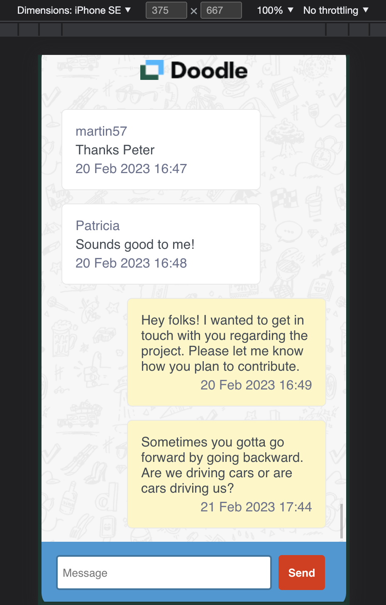

# The challenge (Frontend Engineer)

We built here a simple chat interface in Javascript, which can send and display messages from
all senders.

## The stack

### - React

### - Vite

### - ESLint/Prettier

### - Styled components

### - Axios

- This package has been chosen without being strongly opinionated, native Fetch API could be a good solution, Axios automatically stringifies data when sending JavaScript objects to the API using the POST method, so it reduces a little bit the lines of code for each call

### - React-query:

- It handles all the complexity of caching and reloading data as needed, so you don't have to do all of that manually, for instance when here when we post a new message, we added a side-effect that is invalidating the fetchMessages query that re-triggers it to display the last up-to-date data

## How it could be improved?

### UX/Accessibility

- User Notifications: we could notify users about successful task completion, and any errors, and provide instructions to help them correct mistakes
- Handling users: the UX is really simple now, we can for instance ask the user to prompt his username and fetch it dynamically instead of defining an author by default

### Testing

- Testing: we have only implemented a really basic test, and the test coverage should be improved, for instance, we can mock the API response and test if the data is displayed properly in the chatBody, etc.

### Handling errors

- Handling errors: we didn't handle API errors here due to a lack of time but that's something we should have done in a production app

## Accessibility

To make this app as accessible as possible, and that follows WCAG guidelines, we have implemented these two packages:

- jsx-a11y: it is an ESLint plugin that identifies and enforces several accessibility rules directly in our JSX
- axe-core: Axe is a fast and lightweight accessibility testing tool that checks the entire document against the rules and generates a report with all violations, passes, etc.

## Feedback

Thanks for having a look at this technical challenge, I am willing to get any feedback, and a special bonus for finding the author of this citation: "Sometimes you gotta go forward by going backward. Are we driving cars or are cars driving us?".

## How it looks like:

<video src='doodle-chat.mov' width=360>
