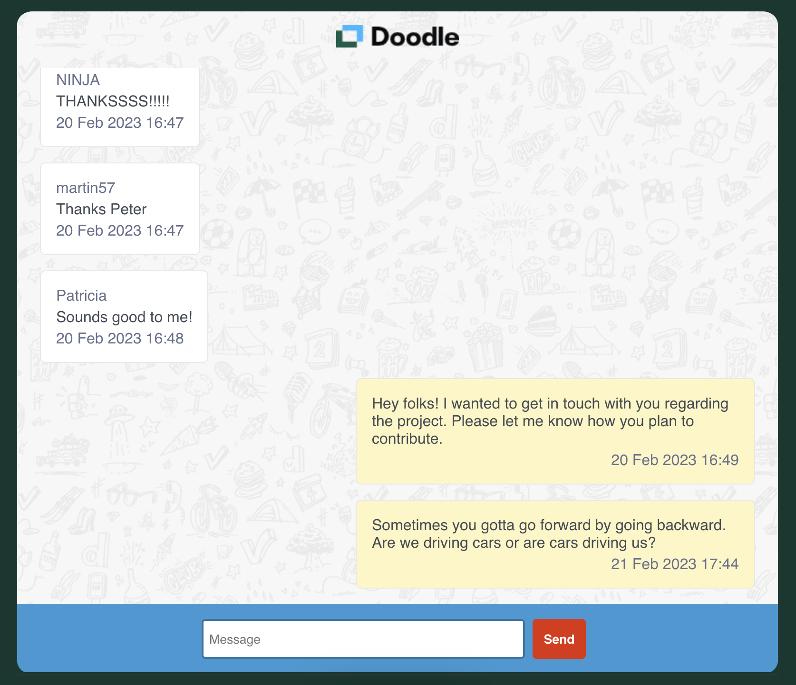

# The challenge (Frontend Engineer)

We built here a simple chat interface in Javascript, which can send and display messages from
all senders.

## The stack

### - React

- React's component-based architecture, virtual DOM, and rich ecosystem of tools and libraries make it an excellent choice for building modern and simple web applications like that.

### - Vite

- Vite's small size and performance-focused design make it a fair choice for React, especially for projects that require fast builds and quick iteration cycles.

### - ESLint/Prettier

- They help ensure code consistency, reduce errors, and improve collaboration. ESLint enforces coding standards and identifies potential issues, while Prettier automatically formats code to a consistent style. Together, they can save our time and effort, improve code quality, and enhance the overall development process.

### - Styled components

- It simplifies complex styling requirements and eliminates class name collisions, reducing the potential for errors. With styled-components, we can create dynamic and reusable styled components that are easy to maintain and optimize.

### - Axios

- This package has been chosen without being strongly opinionated, native Fetch API could be a good solution. It simplifies the process of sending asynchronous requests to a server, allowing us to write cleaner and more efficient code.

### - React-query:

- It handles all the complexity of caching and reloading data as needed, so you don't have to do all of that manually, for instance when here when we post a new message, we added a side-effect that is invalidating the fetchMessages query that re-triggers it to display the last up-to-date data.

## How it could be improved?

### UX/Accessibility

- User Notifications: we could notify users about successful task completion, and any errors, and provide instructions to help them correct mistakes
- Handling users: the UX is really simple now, we can for instance ask the user to prompt his username and fetch it dynamically instead of defining an author by default

### Testing

- Testing: we have only implemented a really basic test, and the test coverage should be improved, for instance, we can mock the API response and test if the data is displayed properly in the chatBody, etc.

### Handling errors

- Handling errors: we didn't handle API errors here due to a lack of time but that's something we should have done in a production app

## Accessibility

To make this app as accessible as possible, and that follows WCAG guidelines, we have implemented these two packages:

- jsx-a11y: it is an ESLint plugin that identifies and enforces several accessibility rules directly in our JSX.
- axe-core: Axe is a fast and lightweight accessibility testing tool that checks the entire document against the rules and generates a report with all violations, passes, etc. For instance, we had to adjust some colors here to respect the minimum contrast required by these guidelines.

## Feedback

Thanks a lot for having a look at this technical challenge, I am willing to get any kind of feedback.

## How it looks like:

## Run the app

- Please execute in your terminal `npm run dev` to run the app locally
